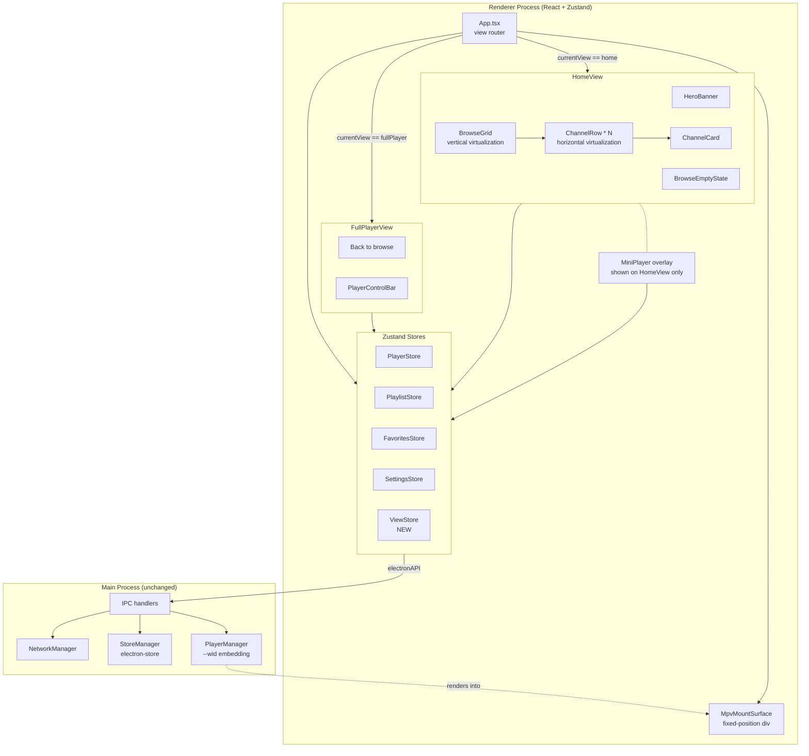
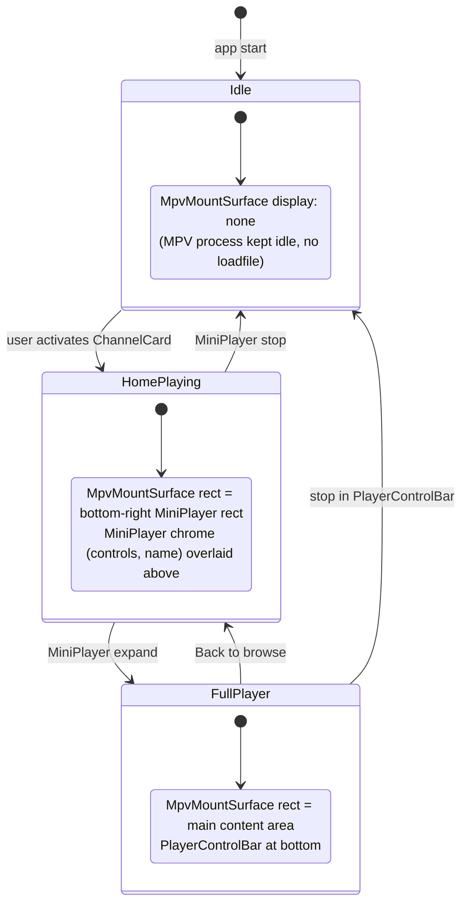
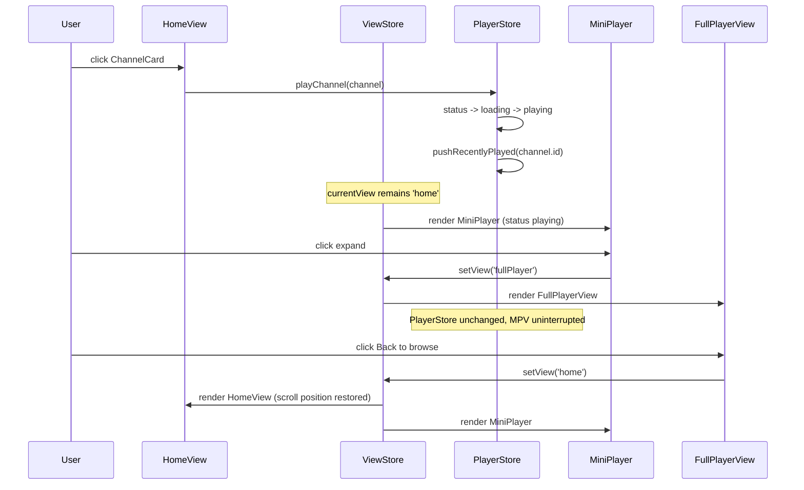
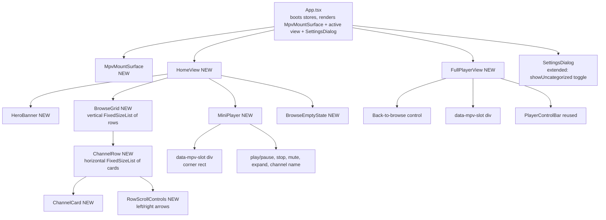

# Design Document

## Overview

This redesign turns the IPTV desktop player from a 3-pane sidebar layout into a cinematic, browser-first experience. The renderer launches into a **HomeView** that presents a hero banner above a vertical stack of horizontally scrolling **ChannelRows**, with a **MiniPlayer** anchored in the bottom-right when playback is active. A dedicated **FullPlayerView** provides an immersive watching mode reachable from the MiniPlayer's expand button.

The redesign is a renderer-only change. The data model (`src/shared/types/index.ts`), the Zustand stores (PlayerStore, PlaylistStore, FavoritesStore, SettingsStore), the Electron IPC bridge, the MPV `--wid` embedding, the M3U parser, and `electron-store` persistence are all preserved. New work is concentrated in:

1. A new `CategoryExtractor` pure module that supersedes `extractCategories()`, splitting compound `group` values on `;` and producing both a category-to-channel map and an uncategorized bucket.
2. New view-routing state (`currentView: 'home' | 'fullPlayer'`) with persistence.
3. New persisted state fields: `showUncategorized`, `currentView`, and a `recentlyPlayedChannelIds` ring buffer (last 10) used for hero priority.
4. A constrained MPV-surface management strategy that lets the same embedded `--wid` surface appear inside the MiniPlayer corner on HomeView or fill the FullPlayerView, without creating a second player process.
5. Vertical and horizontal virtualization (react-window) sized for 12,000+ channels at 50+ FPS.

### Key Design Decisions

| Decision | Choice | Rationale |
|---|---|---|
| MPV surface sharing | Single fixed-position DOM "MPV mount" repositioned via CSS | MPV is bound to a single X11 window handle on `PlayerManager.initialize()` and cannot be moved between React subtrees. A single fixed-position div whose CSS rect is driven by view state lets the same surface appear as a corner mini-player or as a full-window canvas. |
| Vertical virtualization | `react-window` `FixedSizeList` of rows + viewport-buffer | Rows have a fixed height (heading + card track), so `FixedSizeList` is sufficient. Buffer of 600 px above/below viewport per Requirement 11.2. |
| Horizontal virtualization | `react-window` `FixedSizeList` per row, `layout="horizontal"` | Each row scrolls independently. Cards have a fixed width per breakpoint, so horizontal `FixedSizeList` works without measurement. |
| Category derivation | Pure function returning `{ categoryToChannels: Map, uncategorized: Channel[] }` | Memoizable per `(channels, showUncategorized)`. Avoids the existing flat-string approach, which collapses compound tags into one. |
| View routing | New `ViewStore` with `currentView` + `homeScrollY`, persisted | Scroll restoration (Requirement 1.3) and the most-recent-view persistence (Requirement 9.5) need a small dedicated store; mixing into PlayerStore would couple navigation to playback state. |
| Hero selection | `recentlyPlayedChannelIds` (size 10) on PlayerStore + persisted | Requirement 2.4 "most recently played" needs cross-session memory. A bounded ring buffer keeps storage cost trivial. |
| Settings extension | Add `showUncategorized: boolean` (default `false`) to PersistedState and SettingsStore | Requirement 6.1 default behavior is to hide the noisy bucket. |
| Component library | Continue with shadcn/ui + Tailwind | Already in repo; `Card`, `Button`, `Input`, `lucide-react` icons cover the new components. |

## Architecture

### High-level architecture



### MPV surface management (the central constraint)

`PlayerManager.initialize(windowHandle, mpvPath)` binds MPV to one X11 window via `--wid=<native-handle>`. That handle is the **whole BrowserWindow**, not an arbitrary div, so MPV draws on top of the entire window's content area. The redesign needs a single rectangle within the renderer that "owns" MPV's visible region in two different React layouts (mini-player corner on HomeView, full canvas on FullPlayerView).

The solution: a single **`MpvMountSurface`** component rendered at the top of the React tree as a `position: fixed` div with `z-index: 0` (or whichever layer sits below interactive UI). Its CSS rect (`top`, `left`, `width`, `height`) is driven by view state, not by where the player "appears" in the React tree:



#### Surface rect computation

The `MpvMountSurface` reads two values:

1. `currentView` from `ViewStore`.
2. The bounding rect of a "target slot" element rendered inside the active view. Each view places a hidden empty `<div data-mpv-slot>` at the position MPV should occupy. A `ResizeObserver` and a `useLayoutEffect` watch the slot's `getBoundingClientRect()` and write `{top, left, width, height}` to the fixed-position MpvMountSurface.

This pattern means:

- The MPV pixel surface is **never unmounted** during navigation — only its rect changes — so playback never blinks.
- The visible MPV region is exactly one rectangle at any time. When `currentView === 'home'` and the player is active, the rect is the MiniPlayer corner; when `currentView === 'fullPlayer'`, the rect is the main content area; when status is `idle`/`error`, the surface is `display: none` (the MPV process is idle, no `loadfile` issued).
- The MiniPlayer's controls (play/pause, stop, mute, expand, channel name) are sibling elements rendered **above** the MpvMountSurface using `z-index` and `pointer-events: auto` while the surface itself has `pointer-events: none` so it does not eat clicks meant for cards behind it (the surface only spans its own corner rect, but pointer-none prevents accidental interception during transition).
- Resize during transitions uses CSS transitions with a short duration (~150 ms) on `top/left/width/height` only when going between corner and full; instantaneous otherwise.

#### Why not portals or "remount the surface in each view"

We considered using React portals to project the MPV-target div into HomeView vs FullPlayerView. That would still require unmounting/remounting the underlying DOM node, which on X11 means losing the rect that MPV draws into. MPV accepts a fixed `wid` for its lifetime; remapping it requires either restarting MPV (unacceptable per Requirements 8.1, 9.4) or using `--vo=libmpv` with a dedicated render context (out of scope — the existing player is `--wid` based).

A single fixed surface with CSS-driven layout is the smallest change consistent with the existing `--wid` approach.

### View routing



## Components and Interfaces

### Component tree (new and changed)



Components removed/retired from the active layout (kept in the repo for now to ease incremental migration but no longer rendered): `AppLayout`, `Sidebar`, `CategoryList`, `ChannelList`, `IdleView`, `LoadingView`, `ErrorView`. `PlayerView.tsx` is replaced by `MpvMountSurface`.

### Component contracts

#### `App.tsx` (rewritten)

Responsibilities:
- Boot stores (`PlaylistStore.loadFromPersisted`, `FavoritesStore.loadFromPersisted`, `SettingsStore.loadFromPersisted`, `ViewStore.loadFromPersisted`, `PlayerStore` volume/mute restore).
- Subscribe to `subscribeToPlayerEvents()`.
- Render exactly one of `HomeView` or `FullPlayerView` based on `useViewStore.currentView`.
- Always render `MpvMountSurface` (it self-hides when status is idle/error).
- Always render `SettingsDialog` (it self-hides when not open).

#### `MpvMountSurface` (new)

```typescript
// src/renderer/components/MpvMountSurface.tsx
export interface MpvMountSurfaceProps {
  /** Whether the surface should be visible at all (status playing or paused). */
  visible: boolean;
  /** The DOM rect of the slot the surface should occupy, in viewport coordinates. */
  rect: { top: number; left: number; width: number; height: number } | null;
}

export const MpvMountSurface: React.FC<MpvMountSurfaceProps>;
```

- Renders a `<div data-testid="mpv-mount" />` with `position: fixed`, `pointer-events: none`, `background: black`.
- Visibility and rect are read from `ViewStore.mpvRect` (computed by views; see below).
- The surface itself contains nothing — MPV draws on top of the BrowserWindow at this rect because the rest of the renderer above this div is transparent at that rect (MiniPlayer chrome is positioned with higher `z-index` but does not cover the video region; the FullPlayerView's controls are below the video region).

> **Constraint documented:** Because MPV is bound to a single X11 window handle and renders to whatever rectangle is exposed (i.e., not occluded) within that window, the renderer cooperates by leaving the chosen rect free of opaque content. Only one `data-mpv-slot` is "active" at any time. The MiniPlayer and FullPlayerView are mutually exclusive — exactly one of them is mounted per `currentView`.

#### `useMpvSlot()` hook (new)

```typescript
// src/renderer/hooks/useMpvSlot.ts
/**
 * Mount a div ref'd as the active MPV slot. Reports its rect to ViewStore.
 * On unmount, clears ViewStore.mpvRect to null.
 * Uses ResizeObserver + window 'resize' + scroll listener.
 */
export function useMpvSlot(active: boolean): React.RefObject<HTMLDivElement>;
```

#### `HomeView` (new)

```typescript
// src/renderer/components/HomeView.tsx
export const HomeView: React.FC;
```

Responsibilities:
- Reads `channels` and `searchTerm` from `PlaylistStore`, `showUncategorized` from `SettingsStore`, `favoriteIds` from `FavoritesStore`, `currentChannel` and `recentlyPlayedChannelIds` from `PlayerStore`, `homeScrollY` from `ViewStore`.
- Calls `extractCategoriesV2(channels, { showUncategorized })` (memoized via `useMemo` keyed on `channels` identity and `showUncategorized`).
- Renders `<HeroBanner />`, `<BrowseGrid />`, optional `<MiniPlayer />`, optional `<BrowseEmptyState />`.
- Restores scroll position on mount from `ViewStore.homeScrollY`; writes scroll position to ViewStore on unmount (Requirement 1.3).
- Determines the featured channel via `selectFeaturedChannel(channels, recentlyPlayedChannelIds, favoriteIds)` (Requirement 2.4).

#### `HeroBanner` (new)

```typescript
// src/renderer/components/HeroBanner.tsx
export interface HeroBannerProps {
  channel: Channel | null;
  /** Tags to display under the channel name (already split). */
  categoryTags: string[];
  onPlay: () => void;
}

export const HeroBanner: React.FC<HeroBannerProps>;
```

- Height: clamped to `[280, 420] px` at default; reduced to `[200, 280] px` when window width < 1024 px (Requirements 2.1, 12.4).
- Logo loading rules per Requirements 2.5–2.6:
  - On `img.onload`, measure `naturalHeight` after `object-fit: contain` projection. If projected height ≥ 20 px, render the logo at height clamped to `[20, 160] px` and **do not** render the channel name as a substitute alongside the logo.
  - On `img.onerror` or projected height < 20 px, switch to the text-only treatment using `channel.name` and **do not** retry the same URL during the current view session (tracked by a per-instance `retriedUrls: Set<string>`).
- Play button calls `PlayerStore.playChannel(channel)`.

#### `BrowseGrid` (new)

```typescript
// src/renderer/components/BrowseGrid.tsx
export interface BrowseGridProps {
  rows: ChannelRowData[];
  /** Total scroll position (in px) restored from ViewStore. */
  initialScrollY: number;
  onScrollYChange: (y: number) => void;
}

export interface ChannelRowData {
  category: string;             // display label
  channels: Channel[];          // already filtered for searchTerm/showUncategorized
  isFavoritesRow: boolean;
}

export const BrowseGrid: React.FC<BrowseGridProps>;
```

- Uses `react-window` `FixedSizeList` (vertical) where each item is a `<ChannelRow />`.
- Item size: hero-row removed (HeroBanner is rendered outside the list), each ChannelRow ~= 240 px (40 px heading + 200 px card track at default + spacing).
- `overscanCount`: 1 (the 600 px buffer of Requirement 11.2 is satisfied by `overscanCount * itemSize ≥ 600`; for a row size of 240 px, `overscanCount: 3` gives 720 px).

#### `ChannelRow` (new)

```typescript
// src/renderer/components/ChannelRow.tsx
export interface ChannelRowProps {
  category: string;
  channels: Channel[];
  cardWidth: number;
  cardHeight: number;
}

export const ChannelRow: React.FC<ChannelRowProps>;
```

- Renders a heading (`<h2>` styled as section heading with the category name and channel count, Requirements 3.3, 10.6).
- Renders a horizontal `FixedSizeList` (`layout="horizontal"`) of `<ChannelCard />` when `channels.length > 20` (Requirement 3.6); for ≤ 20 channels, renders a flex row directly (cheaper).
- Provides left/right `RowScrollControls` shown on hover/focus (Requirement 3.7); each click programmatically scrolls the list by `viewportWidth`.
- Manages keyboard arrow handling (Requirements 10.4, 10.5):
  - ArrowLeft/Right move focus to neighbor card and scroll the list to keep the focused card visible.
  - ArrowUp/Down emit a row-level event picked up by `BrowseGrid` to move focus to the closest-x card in the previous/next row.

#### `ChannelCard` (new)

```typescript
// src/renderer/components/ChannelCard.tsx
export interface ChannelCardProps {
  channel: Channel;
  width: number;             // from breakpoint, Requirement 12
  height: number;            // = width * 9/16
  isFavorite: boolean;
  onPlay: (channel: Channel) => void;
  onToggleFavorite: (channelId: string) => void;
}

export const ChannelCard: React.FC<ChannelCardProps>;
```

- Visual layout (Requirement 4):
  - 16:9 outer frame (`aspect-ratio: 16/9` fallback to `width:height` calculated).
  - Top region (logo): ~70 % of height, `display: flex; align-items: center; justify-content: center; overflow: hidden`. ``. On `onerror` or absent `logo`, render an initial-letter fallback on a neutral gradient.
  - Bottom region (name): single line, `text-overflow: ellipsis`, full name as `title` attribute (Requirement 4.5).
- Logo failure fallback within 100 ms (Requirement 11.5): the `onError` handler synchronously sets a `loadFailed` state; CSS does not re-issue the request.
- 5-second logo timeout (Requirement 4.4): a `setTimeout(5000)` guard sets `loadFailed=true` if neither `onload` nor `onerror` has fired.
- Hover treatment (Requirement 4.6): CSS `transition: transform 150ms ease, box-shadow 150ms ease` with `:hover { transform: scale(1.06); }`.
- Click handler calls `onPlay(channel)`.
- Favorite button (Requirement 4.8, 10.7): a small `<button aria-pressed={isFavorite}>` over the corner with `stopPropagation` so it does not trigger play.
- Focus outline (Requirement 10.2): `:focus-visible { outline: 2px solid var(--focus); outline-offset: 2px; }` with sufficient contrast.

#### `MiniPlayer` (new)

```typescript
// src/renderer/components/MiniPlayer.tsx
export const MiniPlayer: React.FC;
```

- Reads `currentChannel`, `status`, `volume`, `muted` from PlayerStore.
- Visible when `status === 'playing' || status === 'paused'` and `currentView === 'home'` (Requirements 7.1, 8.5).
- Layout: bottom-right, ≥ 16 px margin from window edges, width clamped to `[320, 480] px`, 16:9 aspect ratio (Requirements 7.1, 7.3).
- Contains a `data-mpv-slot` div via `useMpvSlot(active=true)` — this is the rect MPV occupies.
- Sibling controls overlaid in the bottom strip: play/pause, stop, mute, expand, channel name (Requirement 7.4).
- Stop button: `PlayerStore.stop()`; `status` transitions to idle and the MiniPlayer auto-hides.
- Expand button: `ViewStore.setView('fullPlayer')`.
- `position: fixed` so it does not scroll with the HomeView (Requirement 7.7).
- ARIA: `role="region" aria-label="Mini player: {channel name}"` (Requirement 10.8); a global keyboard shortcut (e.g., `M`) routes focus to the play/pause control.

#### `FullPlayerView` (new)

```typescript
// src/renderer/components/FullPlayerView.tsx
export const FullPlayerView: React.FC;
```

- Header strip with a "Back to browse" button that calls `ViewStore.setView('home')` (Requirements 8.3, 8.4).
- Body: a `data-mpv-slot` div via `useMpvSlot(active=true)` filling the remaining content area (Requirement 8.2).
- Footer: reuses existing `<PlayerControlBar />` (Requirement 8.6).
- Does **not** render the MiniPlayer (Requirement 8.5).

#### `BrowseEmptyState` (new)

```typescript
// src/renderer/components/BrowseEmptyState.tsx
export interface BrowseEmptyStateProps {
  reason: 'no-playlist' | 'all-uncategorized-hidden';
}
```

Displays guidance text per Requirement 1.4:
- `no-playlist`: "Add a playlist to start browsing."
- `all-uncategorized-hidden`: "All channels in this playlist are uncategorized. Enable 'Show uncategorized channels' in Settings to see them."

#### `SettingsDialog` (extended)

Adds a new section "Browse":
- Toggle "Show uncategorized channels" reading/writing `SettingsStore.showUncategorized` (Requirement 6.5).
- A subtitle showing "{N} hidden uncategorized channels" when the toggle is off and the active playlist has at least one uncategorized channel (Requirement 6.7). N is computed by subscribing to `useUncategorizedCount()` (a selector hook over PlaylistStore + the v2 extractor).

### Store extensions

#### `ViewStore` (new)

```typescript
// src/renderer/stores/viewStore.ts
export type ViewName = 'home' | 'fullPlayer';

export interface ViewStore {
  currentView: ViewName;
  homeScrollY: number;          // for scroll restoration (Requirement 1.3)
  mpvRect: { top: number; left: number; width: number; height: number } | null;

  setView: (view: ViewName) => Promise<void>;     // persists currentView
  setHomeScrollY: (y: number) => void;            // not persisted across sessions
  setMpvRect: (rect: ViewStore['mpvRect']) => void;
  loadFromPersisted: () => Promise<void>;
}

export const useViewStore: UseBoundStore<StoreApi<ViewStore>>;
```

- `setView` writes `currentView` to electron-store under key `currentView` (Requirement 9.5).
- `mpvRect` is intentionally **not** persisted; it is derived from layout each frame.

#### `SettingsStore` (extended)

```typescript
export interface SettingsStore {
  mpvBinaryPath: string;
  showUncategorized: boolean;       // NEW; default false (Requirement 6.1)
  isValidating: boolean;
  validationError: string | null;

  setMpvPath: (path: string) => Promise<void>;
  setShowUncategorized: (value: boolean) => Promise<void>;   // NEW; persists
  loadFromPersisted: () => Promise<void>;                    // also loads showUncategorized
}
```

#### `PlayerStore` (extended)

```typescript
export interface PlayerStore {
  // existing...
  status: PlayerState['status'];
  currentChannel: Channel | null;
  volume: number;
  muted: boolean;
  error: string | null;

  // NEW
  recentlyPlayedChannelIds: string[];   // ring buffer, capacity 10, MRU at index 0

  // existing actions, plus playChannel internally pushes the channel onto recentlyPlayedChannelIds
  playChannel: (channel: Channel) => Promise<void>;
  stop: () => Promise<void>;
  togglePause: () => Promise<void>;
  setVolume: (level: number) => Promise<void>;
  toggleMute: () => Promise<void>;
  syncFromMain: (state: Partial<...>) => void;

  // NEW
  loadFromPersisted: () => Promise<void>;     // hydrates recentlyPlayedChannelIds + volume + muted
}
```

`recentlyPlayedChannelIds` is updated by `playChannel`:

```typescript
function pushRecent(ids: string[], id: string): string[] {
  const without = ids.filter(x => x !== id);
  return [id, ...without].slice(0, 10);
}
```

After update, the new array is persisted via `electronAPI.store.set('recentlyPlayedChannelIds', next)`.

### CategoryExtractor module (new)

```typescript
// src/shared/utils/categoryExtractor.ts
export interface ExtractedCategories {
  /** Ordered map: insertion order is "Favorites" first (when applicable), then alphabetical (locale-aware). */
  categoryToChannels: Map<string, Channel[]>;
  /** Channels whose group resolves to uncategorized per the rules below. */
  uncategorized: Channel[];
  /** Total count of uncategorized channels (= uncategorized.length, exposed for convenience). */
  uncategorizedCount: number;
}

export interface ExtractOptions {
  /** When true, include "Uncategorized" as the last entry of categoryToChannels containing all uncategorized channels. */
  showUncategorized: boolean;
  /** Set of channel IDs marked favorite. Used to seed the "Favorites" row. */
  favoriteIds: Set<string>;
}

/**
 * Pure function. Output depends only on (channels, options).
 * No side effects, no Date/Math.random, no IPC.
 * Stable for memoization keyed on (channels reference, showUncategorized, favoriteIds reference).
 */
export function extractCategoriesV2(
  channels: readonly Channel[],
  options: ExtractOptions,
): ExtractedCategories;
```

#### Algorithm

```
1. Initialize:
   uncategorized: Channel[] = []
   raw: Map<string, Channel[]> = new Map()
   favoritesBucket: Channel[] = []

2. For each channel in channels:
   a. Let g = channel.group (may be undefined)
   b. If g is missing/empty after .trim() OR g.trim().toLowerCase() in {"undefined", "uncategorized"}:
      push channel into uncategorized
      (do NOT push into any raw category)
   c. Else:
      Split g on ';' -> tags
      For each tag:
        t = tag.trim()
        If t === "" -> skip
        // case-sensitive de-dup (Requirement 5.5)
        If !raw.has(t) -> raw.set(t, [])
        raw.get(t).push(channel)
   d. If favoriteIds.has(channel.id) AND channel was placed into at least one regular category:
      // Favorites row contains only channels that would otherwise be visible
      favoritesBucket.push(channel)

3. Build the ordered output map:
   ordered = new Map<string, Channel[]>()
   If favoritesBucket.length > 0:
     ordered.set("Favorites", favoritesBucket)
   Sort raw keys with Intl.Collator(undefined, {sensitivity: "variant"}).compare
   For each sortedKey: ordered.set(sortedKey, raw.get(sortedKey))
   If options.showUncategorized AND uncategorized.length > 0:
     ordered.set("Uncategorized", uncategorized)

4. Return { categoryToChannels: ordered, uncategorized, uncategorizedCount: uncategorized.length }
```

Notes:
- The function preserves the original Channel array order within each category bucket — this is what makes Requirement 5.4 ("a channel appears in a row iff that category is in the channel's tag set") deterministically testable.
- The "Favorites" row contains a channel only if it is a favorite **and** the channel has at least one regular category (i.e., not uncategorized). Uncategorized favorites are surfaced inside the Uncategorized row when the toggle is on.
- Sorting uses `Intl.Collator` with `sensitivity: 'variant'` to keep "Movies" and "movies" distinct (Requirement 5.5) while still sorting locale-aware.
- The function is O(N · T) where N = total channels and T = average number of tags per channel; well under 5 ms for 12,000 channels with average T < 3 in practice.

### Selector helper: `selectFeaturedChannel`

```typescript
// src/renderer/utils/heroSelector.ts
export function selectFeaturedChannel(
  channels: readonly Channel[],
  recentlyPlayedChannelIds: readonly string[],
  favoriteIds: ReadonlySet<string>,
): Channel | null;
```

Algorithm (Requirement 2.4):

```
1. If channels is empty -> return null
2. For each id in recentlyPlayedChannelIds (MRU first):
     find channel with channel.id === id AND channel is in `channels`
     if found -> return that channel
3. For each channel in channels (in input order):
     if favoriteIds.has(channel.id) -> return channel
4. Return channels[0]
```

This is a pure function, suitable for property testing.

### Card sizing (responsive breakpoints)

Implemented as a `useCardSize()` hook reading `window.innerWidth` (subscribed via `resize` event with a 250 ms trailing debounce per Requirement 12.5):

| Window width (px) | Card width range (px) | Card height (px) | Hero height range (px) |
|---|---|---|---|
| < 1024 | 140–160 | width × 9/16 | 200–280 |
| 1024–1439 | 160–180 | width × 9/16 | 280–420 |
| 1440–1919 | 180–220 | width × 9/16 | 280–420 |
| ≥ 1920 | 220–260 | width × 9/16 | 280–420 |

Within each band the actual width is computed as `clamp(min, floor((available - gutter) / cardsPerView), max)` so the right edge of the row aligns to a card boundary at typical widths.

## Data Models

### Existing types (unchanged)

`Channel`, `Playlist`, `PersistedPlaylist`, `PlayerState`, `IPCCommands`, `IPCEvents`, `ElectronAPI`, error classes — all untouched.

### Extensions to `PersistedState`

```typescript
// src/shared/types/index.ts (additions)
export type ViewName = 'home' | 'fullPlayer';

export interface PersistedState {
  // existing fields unchanged
  playlists: PersistedPlaylist[];
  favorites: string[];
  volume: number;
  muted: boolean;
  lastActivePlaylistId: string | null;
  mpvBinaryPath: string | null;

  // NEW
  showUncategorized: boolean;                 // default: false (Requirement 6.1)
  currentView: ViewName;                      // default: 'home'  (Requirement 9.5)
  recentlyPlayedChannelIds: string[];         // default: [], capacity 10, MRU first (Requirement 2.4)
}
```

### Extensions to `ElectronAPI` (none)

Existing `store.get(key)` / `store.set(key, value)` already cover the new fields; no new IPC channels required.

### `StoreManager` defaults (electron/store.ts)

```typescript
const DEFAULTS: PersistedState = {
  playlists: [],
  favorites: [],
  volume: 50,
  muted: false,
  lastActivePlaylistId: null,
  mpvBinaryPath: null,
  showUncategorized: false,             // NEW
  currentView: 'home',                  // NEW
  recentlyPlayedChannelIds: [],         // NEW
};
```

Schema validation:
- `currentView` clamped to `'home' | 'fullPlayer'` (any other value resets to `'home'`).
- `showUncategorized` coerced to boolean.
- `recentlyPlayedChannelIds` truncated to length 10 on read; non-string entries dropped.

### View-state shapes (in-memory only)

```typescript
export interface ChannelRowData {
  category: string;
  channels: Channel[];
  isFavoritesRow: boolean;
}

export interface MpvRect {
  top: number;
  left: number;
  width: number;
  height: number;
}
```

## Performance and virtualization strategy

Vertical:
- `BrowseGrid` uses a single `react-window` `FixedSizeList` rendering one `ChannelRow` per item.
- Row height is fixed per breakpoint at construction time (e.g., 240 px). Hero is rendered above the list so it does not interact with virtualization.
- `overscanCount = 3` ⇒ 720 px of off-screen rows kept warm, satisfying the 600 px buffer (Requirement 11.2).

Horizontal (per row):
- Rows with `channels.length > 20` use a horizontal `FixedSizeList` with `layout="horizontal"`, `itemSize = cardWidth + gutter`, `overscanCount = 2` (Requirement 11.3).
- Rows with ≤ 20 channels skip virtualization.

Re-render cost control:
- `extractCategoriesV2` result is memoized per `(channels, showUncategorized, favoriteIds)`. `searchTerm` is applied as a per-row filter inside `ChannelRow`'s `useMemo`, not by re-running the extractor — so typing in the search box never re-derives categories.
- `ChannelCard` is wrapped in `React.memo` with shallow prop comparison (channel reference, isFavorite, width).
- `useCardSize` debounces resize at 250 ms trailing edge (Requirement 12.5).

First-paint target (Requirement 11.4):
- The vertical virtualization plus row-level horizontal virtualization keeps the initial DOM cost to `(rows visible) × (cards visible per row)` ≈ 4 rows × 12 cards = 48 cards regardless of total channel count, well under the 500 ms first-paint budget for ≤ 10,000 channels on the baseline configuration.

Logo loading (Requirement 11.5):
- The `` element's `onerror` handler synchronously toggles a state flag rendered as the initial-letter fallback in the same render pass (≤ 100 ms).
- A per-instance `Set<string>` of failed URLs prevents re-issuing the same request during the view session; the failed URL is captured in component state, not re-bound to the ``.

## Correctness Properties


*A property is a characteristic or behavior that should hold true across all valid executions of a system — essentially, a formal statement about what the system should do. Properties serve as the bridge between human-readable specifications and machine-verifiable correctness guarantees.*

The following properties cover the testable acceptance criteria after prework reflection (see design notes). Layout-only criteria (HeroBanner height bands, mini-player positional CSS, focus outline contrast, hover transitions) and pure performance benchmarks (50 FPS during scroll, 500 ms first-paint) are not represented as properties — they are covered by example/snapshot tests and manual benchmarks per the Testing Strategy.

### Property 1: Category membership matches semicolon-split tag set

*For any* array of Channels and any showUncategorized setting, after running `extractCategoriesV2`, a Channel `c` appears in `categoryToChannels.get(t)` if and only if `t` is a non-empty trimmed segment of `c.group.split(';')` AND `c` is not classified as uncategorized.

**Validates: Requirements 5.1, 5.2, 5.3, 5.4**

### Property 2: Case-sensitive deduplication preserves source casing

*For any* array of Channels containing groups that differ only in letter casing (e.g., "Movies" and "movies"), `extractCategoriesV2` produces distinct keys in `categoryToChannels` for each casing variant, and each such key is associated with exactly the Channels whose `group` (after split + trim) matches that exact casing.

**Validates: Requirements 5.5**

### Property 3: CategoryExtractor is pure and deterministic

*For any* array of Channels and any options object, calling `extractCategoriesV2(channels, options)` twice in succession produces deeply equal `ExtractedCategories` results, and neither call observes wall-clock time or random state (verified by mocking `Date.now` and `Math.random` to throw).

**Validates: Requirements 5.6**

### Property 4: Uncategorized classification rule

*For any* Channel `c`, `extractCategoriesV2` classifies `c` as uncategorized if and only if `c.group` is missing, or `c.group.trim() === ''`, or `c.group.trim().toLowerCase() ∈ {"undefined", "uncategorized"}`. Compound groups containing one of these tokens alongside a real tag are *not* classified as uncategorized — the real tag wins.

**Validates: Requirements 6.2**

### Property 5: `showUncategorized` toggles the uncategorized bucket atomically

*For any* array of Channels:
- When `options.showUncategorized === false`, the resulting `categoryToChannels` does not contain a key equal to `"Uncategorized"`, and no value array in `categoryToChannels` contains a Channel that would be classified as uncategorized.
- When `options.showUncategorized === true` and at least one Channel is uncategorized, the **last** entry of `categoryToChannels` (insertion order) is the key `"Uncategorized"` with a value equal to the `uncategorized` array.

**Validates: Requirements 6.3, 6.4**

### Property 6: `uncategorizedCount` equals the size of the uncategorized bucket

*For any* array of Channels and any options, `extractCategoriesV2(channels, options).uncategorizedCount === extractCategoriesV2(channels, options).uncategorized.length`, and that count equals the number of Channels in the input that satisfy the uncategorized classification rule of Property 4.

**Validates: Requirements 6.7**

### Property 7: Row ordering is Favorites-first then locale-alphabetical

*For any* array of Channels and any `favoriteIds` set, the keys of the resulting `categoryToChannels` (in insertion order) satisfy:
- If a `Favorites` bucket is non-empty, the first key is `"Favorites"`.
- The remaining keys (excluding a trailing `"Uncategorized"` if present) form a sequence sorted ascending by `Intl.Collator(undefined, { sensitivity: 'variant' }).compare`.
- If `options.showUncategorized` is true and uncategorized is non-empty, the very last key is `"Uncategorized"`.

**Validates: Requirements 3.2**

### Property 8: `selectFeaturedChannel` follows MRU → favorite → first priority

*For any* array of Channels `cs`, any `recentlyPlayedChannelIds` array `r`, and any `favoriteIds` set `f`, `selectFeaturedChannel(cs, r, f)`:
- Returns `null` iff `cs` is empty.
- Otherwise returns the first channel in `r` (in MRU order) whose id matches some `c.id` for `c ∈ cs`, if any such match exists.
- Otherwise returns the first `c ∈ cs` (input order) such that `f.has(c.id)`, if any.
- Otherwise returns `cs[0]`.

**Validates: Requirements 2.4**

### Property 9: `recentlyPlayedChannelIds` is a capacity-10 MRU ring buffer

*For any* initial array `r` of channel ids and any sequence of channel ids `s = [s1, s2, ..., sn]` pushed via `pushRecent`, the resulting array `r'`:
- Has `length ≤ 10`.
- Contains no duplicates.
- Has `r'[0] === sn` (the most recent push is at the head).
- The set of elements of `r'` equals the set of elements of `[sn, sn-1, ..., sn-9]` filtered by uniqueness, intersected with the initial `r ∪ s`.

**Validates: Requirements 2.4**

### Property 10: View changes do not modify PlayerStore

*For any* PlayerStore state with `status ∈ {idle, loading, playing, paused, error}` and any `currentChannel`, calling `useViewStore.getState().setView(v)` for any `v ∈ {'home', 'fullPlayer'}` (any number of times in any order) leaves `usePlayerStore.getState().status`, `currentChannel`, `volume`, and `muted` unchanged.

**Validates: Requirements 8.1, 8.4, 9.2, 9.3, 9.4**

### Property 11: `currentView` round-trips through persistence

*For any* `v ∈ {'home', 'fullPlayer'}`, after calling `useViewStore.getState().setView(v)` and then re-running `useViewStore.getState().loadFromPersisted()` against the same backing electron-store, the resulting `currentView` equals `v`.

**Validates: Requirements 9.5**

### Property 12: `homeScrollY` round-trips across home→fullPlayer→home

*For any* non-negative integer `y`, after `setHomeScrollY(y)` followed by `setView('fullPlayer')` followed by `setView('home')`, `useViewStore.getState().homeScrollY === y`.

**Validates: Requirements 1.3**

### Property 13: PersistedState defaults are correct on missing fields

*For any* on-disk persisted state with the new fields (`showUncategorized`, `currentView`, `recentlyPlayedChannelIds`) absent, after `loadFromPersisted()` on each store, the in-memory values are: `showUncategorized === false`, `currentView === 'home'`, `recentlyPlayedChannelIds === []`. After also booting the player store, `currentChannel === null` regardless of any prior playback.

**Validates: Requirements 1.1, 6.1, 9.5**

### Property 14: MiniPlayer visibility predicate

*For any* combination of `PlayerStore.status` and `ViewStore.currentView`, the MiniPlayer is mounted in the DOM if and only if `status ∈ {'playing', 'paused'}` AND `currentView === 'home'`.

**Validates: Requirements 7.1, 7.8, 8.5**

### Property 15: MiniPlayer reflects the current channel name without changing position

*For any* sequence of channels `[c1, c2, ..., ck]` played in succession via `playChannel` while `currentView === 'home'`:
- The MiniPlayer's rendered channel-name text equals `ci.name` after each `playChannel(ci)` resolves.
- The MiniPlayer's `getBoundingClientRect()` is invariant across the sequence (top, left, width, height all unchanged).
- The MiniPlayer's accessible name (`aria-label`) contains `ci.name`.

**Validates: Requirements 7.4, 7.6, 10.8**

### Property 16: ChannelCard exposes the full channel name

*For any* Channel `c`, the rendered `<ChannelCard channel={c} />` exposes `c.name` as both the `title` attribute on the card root and as the accessible name reported by `getByRole('button', { name: c.name })`.

**Validates: Requirements 4.5, 10.7**

### Property 17: ChannelCard fallback rendering predicate

*For any* Channel `c`, the rendered `<ChannelCard />`:
- Displays the initial-letter fallback (and not the ``) when `c.logo` is undefined, empty, or after the `` element fires `error`, or after 5 seconds elapse without `load` or `error`.
- Displays the `` (and not the fallback) otherwise.

**Validates: Requirements 4.4**

### Property 18: Failed logo URLs are not retried during a view session

*For any* logo URL `u` whose `` element has fired `error` for one ChannelCard, no subsequent re-render of any ChannelCard with the same `c.logo === u` during the same view session sets an `` attribute equal to `u`. The fallback is rendered immediately.

**Validates: Requirements 2.6, 11.5**

### Property 19: Click handlers route correctly and do not interfere

*For any* Channel `c` and any `isFavorite ∈ {true, false}`:
- Clicking the ChannelCard root triggers `playChannel(c)` exactly once and does not trigger `toggleFavorite`.
- Clicking the favorite button inside the card triggers `toggleFavorite(c.id)` exactly once and does **not** trigger `playChannel`.

**Validates: Requirements 4.7, 4.8**

### Property 20: Keyboard activation on a focused ChannelCard plays the channel

*For any* Channel `c`, when `<ChannelCard channel={c} />` has keyboard focus and the user presses `Enter` or `Space`, `playChannel(c)` is invoked exactly once.

**Validates: Requirements 10.3**

### Property 21: Arrow-key focus navigation is correct

*For any* `BrowseGrid` rendered with `R` rows of card counts `[n_1, ..., n_R]`, and any focused position `(j, i)` with `0 ≤ j < R, 0 ≤ i < n_j`:
- Pressing `ArrowRight` moves focus to `(j, min(i+1, n_j - 1))`.
- Pressing `ArrowLeft` moves focus to `(j, max(i-1, 0))`.
- Pressing `ArrowDown` moves focus to `(min(j+1, R-1), i')` where `i'` is the index in row `j+1` whose card center has the smallest absolute horizontal distance from the focused card's center.
- Pressing `ArrowUp` moves focus to `(max(j-1, 0), i')` analogously.

**Validates: Requirements 10.4, 10.5**

### Property 22: `useCardSize` is a piecewise function within band ranges

*For any* window width `w ≥ 800`, `useCardSize(w).cardWidth` belongs to the range associated with `w`'s band:
- `w ∈ [800, 1024)` → cardWidth ∈ [140, 160]
- `w ∈ [1024, 1440)` → cardWidth ∈ [160, 180]
- `w ∈ [1440, 1920)` → cardWidth ∈ [180, 220]
- `w ≥ 1920` → cardWidth ∈ [220, 260]

In particular (Requirement 12.3 negative clause): for any `w < 1920`, `cardWidth < 220` OR `cardWidth = 220` (the band cap of the 1440–1919 range), and `cardWidth ≤ 220`. The card height is always `cardWidth × 9 / 16` rounded.

**Validates: Requirements 12.1, 12.2, 12.3, 12.4, 12.6**

### Property 23: Virtualization renders a bounded number of rows and cards

*For any* `BrowseGrid` rendered with `R` total rows of `n_j` cards each at the default 1280-px window, the number of `<ChannelRow>` elements actually mounted in the DOM is at most `ceil(viewportHeight / rowHeight) + 2 * overscanCount + 1`, regardless of `R`. Within each mounted row, the number of `<ChannelCard>` elements actually mounted is at most `ceil(rowViewportWidth / itemSize) + 2 * overscanCount + 1`, regardless of `n_j` (when `n_j > 20`).

**Validates: Requirements 3.6, 11.2, 11.3**

### Property 24: BrowseGrid mirrors the extractor output

*For any* array of Channels, `showUncategorized`, and `favoriteIds`, the rendered `<BrowseGrid>` mounts exactly one `<ChannelRow>` for each key in `extractCategoriesV2(channels, ...).categoryToChannels`, in the same order, and each row's count display equals the length of the corresponding value array.

**Validates: Requirements 3.1, 3.3**

## Error Handling

The redesign introduces no new IPC channels, so most error handling continues from the existing core-functionality design. New error-adjacent paths:

| Condition | Handling | User feedback |
|---|---|---|
| Channel logo URL fails / times out | `` flips local `loadFailed` state; fallback initial rendered. URL added to per-session retriedUrls so re-renders skip the request. | Initial-letter fallback in card / banner. No toast. |
| HeroBanner logo too small (< 20 px after contain) | Computed in `onLoad` via `naturalWidth/naturalHeight`; treated as load failure. | Text-only banner treatment. |
| Active playlist becomes empty after `showUncategorized` toggle | `extractCategoriesV2` returns empty `categoryToChannels`. HomeView renders `<BrowseEmptyState reason="all-uncategorized-hidden" />` (Requirement 1.4). | Empty-state guidance with link to Settings. |
| Persisted `currentView` is corrupt / unknown | StoreManager schema clamps to `'home'`. | Silent default to HomeView. |
| Persisted `recentlyPlayedChannelIds` contains stale ids (channels no longer exist) | `selectFeaturedChannel` skips ids not present in the active playlist; falls through to favorite then first. | None — featured channel is computed silently. |
| Persisted `recentlyPlayedChannelIds` exceeds 10 entries (legacy / corrupt) | StoreManager truncates to 10 on read. | None. |
| `setView('fullPlayer')` while `status === 'idle'` | Allowed — FullPlayerView renders the "Back to browse" header + an empty MPV slot. | A small "No channel playing" message inside the otherwise-black canvas. (Note: this case should not normally occur because the expand button only exists on the MiniPlayer, which is hidden when idle.) |
| `MpvMountSurface` rect computation fails (slot not yet mounted) | `useMpvSlot` returns `null` rect; surface is `display: none` for one frame until layout settles. | Brief black flash possible during view transition; mitigated by the 150 ms CSS transition. |
| Window resized below 800 px | The minimum supported width per Requirement 12.6 is 800 px. Below this, layout may overflow but no crash; cards continue to use the smallest band sizes. | Visual overflow only. |

Existing error paths from the core-functionality design (MPV not found, network failures, parse failures, store corruption) are unchanged.

## Testing Strategy

### Property-based tests (fast-check + Vitest)

PBT applies to this feature because the core decisions are driven by pure functions and small reducers:

- `extractCategoriesV2` (pure)
- `selectFeaturedChannel` (pure)
- `pushRecent` ring buffer (pure)
- `useCardSize` width function (pure on `w`)
- `ViewStore.setView` and `setHomeScrollY` (deterministic state transitions)
- React component-level invariants on `ChannelCard` and `MiniPlayer` rendering can be expressed as universal properties over generated channels.

The project already pins `fast-check@4.8.0` and `vitest@^4.0.18`, so no new dependencies are required.

**Configuration:**
- Each property test runs ≥ 100 iterations (`fc.assert(prop, { numRuns: 100 })` minimum; pure-function properties run 500).
- Each test file has a comment block at the top with: `// Feature: cinematic-ui-redesign, Property {n}: {property text}`.
- Each `test(...)` call is tagged inline with the same property number.
- React-component properties use `@testing-library/react` (to be added as a dev dependency) under JSDOM. The MPV surface is mocked as a plain div for these tests.

**Test files (new):**

| File | Properties covered |
|---|---|
| `src/shared/utils/categoryExtractor.property.test.ts` | P1, P2, P3, P4, P5, P6, P7 |
| `src/renderer/utils/heroSelector.property.test.ts` | P8 |
| `src/renderer/stores/playerStore.recent.property.test.ts` | P9 |
| `src/renderer/stores/viewStore.property.test.ts` | P10, P11, P12 |
| `electron/store.cinematicDefaults.property.test.ts` | P13 |
| `src/renderer/components/MiniPlayer.property.test.tsx` | P14, P15 |
| `src/renderer/components/ChannelCard.property.test.tsx` | P16, P17, P18, P19, P20 |
| `src/renderer/components/BrowseGrid.property.test.tsx` | P21, P23, P24 |
| `src/renderer/utils/cardSize.property.test.ts` | P22 |

### Example / unit tests (Vitest)

Layout and CSS-driven behaviors covered by example-based tests:

- HeroBanner height bands at fixed window widths (Requirement 2.1, 12.4).
- HeroBanner logo branch when natural projected height crosses the 20 px threshold (Requirements 2.5, 2.6).
- ChannelCard hover transition CSS, focus outline (Requirements 4.6, 10.2).
- ChannelRow horizontal layout, scroll-control buttons (Requirements 3.4, 3.5, 3.7).
- ChannelRow heading is `<h2>` (Requirement 10.6).
- MiniPlayer position styles (`position: fixed`, bottom-right ≥16 px margin, 16:9 aspect, 320–480 px width) (Requirements 7.1, 7.3, 7.7).
- FullPlayerView mounts `PlayerControlBar` and "Back to browse" button (Requirements 8.3, 8.6).
- SettingsDialog renders the `showUncategorized` toggle and the hidden-count subtitle (Requirements 6.5, 6.7).
- `App.tsx` renders exactly one of HomeView or FullPlayerView (Requirement 9.1) — covered by a mounted-once test across many `currentView` values.

### Integration tests

- Boot path: persisted `currentView === 'fullPlayer'`, `lastActivePlaylistId` set with a valid playlist, status = `idle` → renders FullPlayerView with empty MPV slot, then user clicks "Back to browse" → HomeView with hero/grid populated.
- View transition during playback: `playChannel(c)` → status `playing`, MiniPlayer mounted on HomeView, click expand → FullPlayerView, MPV rect transitions from corner to full, `PlayerStore.status` remains `playing` throughout.
- `showUncategorized` toggle: render HomeView with a playlist whose channels are 90% uncategorized; toggle off → grid empties (BrowseEmptyState shown if no other categories); toggle on → "Uncategorized" appears as the last row.
- Scroll restoration: scroll HomeView to `y = 1500`, expand to FullPlayerView, return → scroll position equals 1500.

### Performance / smoke tests

Performance criteria (Requirements 11.1, 11.4, 12.5) cannot be expressed as PBT properties. They are validated by:

- A scripted load test that constructs a synthetic 10,000-channel playlist, mounts HomeView, and measures `requestAnimationFrame` deltas during programmatic vertical scroll. Pass if median FPS ≥ 50 on the developer machine; full validation requires manual runs on the baseline configuration described in Requirement 11.1.
- A first-paint timing test that wraps the boot sequence in `performance.now()` and asserts elapsed time ≤ 500 ms for ≤ 10,000-channel playlists.
- A debounce smoke test that fires 100 `resize` events in 50 ms and asserts `useCardSize` recomputes exactly once after the trailing 250 ms (Requirement 12.5).

### MPV surface management — manual verification

Because `--wid` embedding is platform-specific (X11) and cannot be exercised in JSDOM, the following are tested manually before release:

- Mini-player → full-player transition: video does not blink, no second MPV process spawns (`ps aux | grep mpv` shows one process before, during, and after).
- Window resize while in MiniPlayer mode: corner rect tracks the window's bottom-right with the configured margin.
- Stop in MiniPlayer: status returns to idle, MPV surface hides, MPV process remains alive (it just has no `loadfile` issued).
