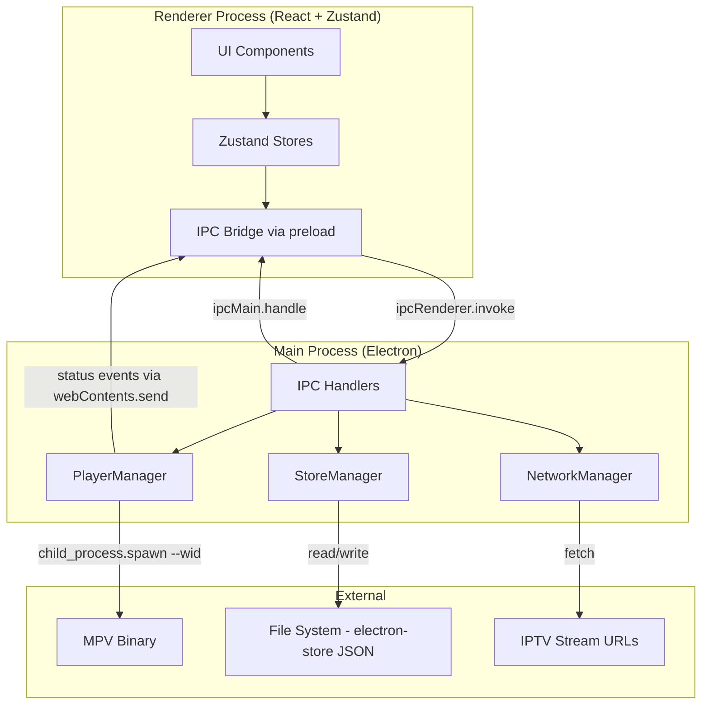
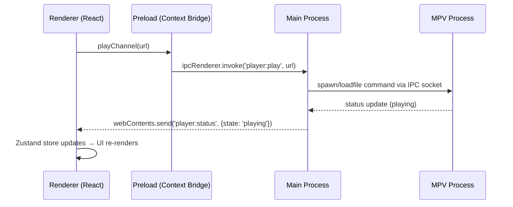
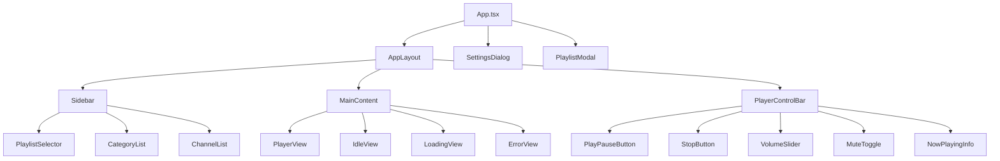

# Design Document

## Overview

This design transforms the IPTV desktop player from an external-window MPV setup into a fully embedded playback experience. The architecture uses a **hybrid playback strategy**: MPV embedded via `--wid` flag (spawned as a child process with the Electron window's native handle) for maximum codec/protocol support, with the option to fall back to hls.js for pure-web HLS playback if MPV is unavailable.

The application follows a clear separation: the **Electron main process** owns player lifecycle, network I/O, and persistent storage; the **React renderer** owns UI state and presentation. Communication flows through typed IPC channels. State management uses **Zustand** in the renderer with persistence backed by **electron-store** in the main process.

### Design Decisions

| Decision | Choice | Rationale |
|----------|--------|-----------|
| Playback engine | MPV via child_process + `--wid` | IPTV streams use diverse codecs (H.264, H.265, MPEG-TS). MPV handles all of them. Embedding via `--wid` on X11 renders directly into the Electron window. |
| Fallback playback | hls.js (optional future) | For HLS-only streams when MPV is unavailable. Not in initial scope but architecture allows it. |
| State management | Zustand | Minimal boilerplate, TypeScript-first, no providers needed. Perfect for medium-complexity app state. |
| Persistence | electron-store | Battle-tested JSON file storage in `app.getPath('userData')`. Atomic writes, schema validation, encryption-ready. |
| IPC pattern | invoke/handle (request-response) + send/on (events) | `invoke` for commands (play, stop, fetch). `send` for push events (player status, errors). |
| Component library | shadcn/ui (existing) | Already in the project. Extend with new components for player controls, settings, category sidebar. |
| Virtualization | react-window (existing) | Already used for channel list. Continue using for large lists. |

## Architecture



### Data Flow



## Components and Interfaces

### Main Process Modules

#### PlayerManager (electron/player.ts - rewrite)

Replaces the current node-mpv wrapper with a direct child_process spawn approach that supports `--wid` embedding.

```typescript
interface PlayerState {
  status: 'idle' | 'loading' | 'playing' | 'paused' | 'error';
  currentUrl: string | null;
  volume: number;
  muted: boolean;
  error: string | null;
}

interface PlayerManager {
  initialize(windowHandle: Buffer, mpvPath: string): void;
  play(url: string): Promise<void>;
  stop(): Promise<void>;
  pause(): Promise<void>;
  resume(): Promise<void>;
  setVolume(level: number): Promise<void>;
  setMute(muted: boolean): Promise<void>;
  getState(): PlayerState;
  destroy(): Promise<void>;
}
```

Implementation approach:
- Spawn MPV with `--wid=<native-handle>` to embed video output into the Electron BrowserWindow
- Use `--input-ipc-server=/tmp/mpv-iptv-socket` for JSON IPC control
- Communicate with MPV via the IPC socket (send commands, receive property changes)
- On Linux/X11: get window handle via `win.getNativeWindowHandle()` which returns the X11 Window ID
- Emit status events to renderer via `webContents.send()`

#### StoreManager (electron/store.ts - new)

Wraps electron-store for typed persistent state.

```typescript
interface PersistedState {
  playlists: PersistedPlaylist[];
  favorites: string[]; // channel IDs
  volume: number;
  muted: boolean;
  lastActivePlaylistId: string | null;
  mpvBinaryPath: string | null;
}

interface PersistedPlaylist {
  id: string;
  name: string;
  url: string;
  channels: Channel[];
}

interface StoreManager {
  get<K extends keyof PersistedState>(key: K): PersistedState[K];
  set<K extends keyof PersistedState>(key: K, value: PersistedState[K]): void;
  getAll(): PersistedState;
  reset(): void;
}
```

Default values:
- `playlists`: `[]`
- `favorites`: `[]`
- `volume`: `50`
- `muted`: `false`
- `lastActivePlaylistId`: `null`
- `mpvBinaryPath`: `null`

#### NetworkManager (electron/network.ts - new)

Handles playlist fetching with timeout support.

```typescript
interface NetworkManager {
  fetchPlaylist(url: string, timeoutMs?: number): Promise<string>;
}
```

- Uses Node.js `fetch` with `AbortController` for 30-second timeout
- Returns raw M3U content string
- Throws typed errors: `NetworkError`, `TimeoutError`, `HttpError`

### Renderer Modules

#### Zustand Stores

**PlayerStore** (src/renderer/stores/playerStore.ts)

```typescript
interface PlayerStore {
  status: 'idle' | 'loading' | 'playing' | 'paused' | 'error';
  currentChannel: Channel | null;
  volume: number;
  muted: boolean;
  error: string | null;

  // Actions
  playChannel: (channel: Channel) => Promise<void>;
  stop: () => Promise<void>;
  togglePause: () => Promise<void>;
  setVolume: (level: number) => Promise<void>;
  toggleMute: () => Promise<void>;
  syncFromMain: (state: Partial<PlayerStore>) => void;
}
```

**PlaylistStore** (src/renderer/stores/playlistStore.ts)

```typescript
interface PlaylistStore {
  playlists: Playlist[];
  activePlaylistId: string | null;
  channels: Channel[];
  selectedCategory: string;
  categories: string[];
  searchTerm: string;
  isLoading: boolean;

  // Actions
  addPlaylist: (url: string, name: string) => Promise<void>;
  removePlaylist: (id: string) => Promise<void>;
  renamePlaylist: (id: string, name: string) => Promise<void>;
  selectPlaylist: (id: string) => void;
  selectCategory: (category: string) => void;
  setSearchTerm: (term: string) => void;
  loadFromPersisted: () => Promise<void>;
}
```

**FavoritesStore** (src/renderer/stores/favoritesStore.ts)

```typescript
interface FavoritesStore {
  favoriteIds: Set<string>;

  // Actions
  toggleFavorite: (channelId: string) => Promise<void>;
  isFavorite: (channelId: string) => boolean;
  loadFromPersisted: () => Promise<void>;
}
```

**SettingsStore** (src/renderer/stores/settingsStore.ts)

```typescript
interface SettingsStore {
  mpvBinaryPath: string;
  isValidating: boolean;
  validationError: string | null;

  // Actions
  setMpvPath: (path: string) => Promise<void>;
  loadFromPersisted: () => Promise<void>;
}
```

### Component Architecture



#### New Components

| Component | Location | Responsibility |
|-----------|----------|----------------|
| `AppLayout` | `src/renderer/components/AppLayout.tsx` | Top-level layout: sidebar + main + control bar |
| `Sidebar` | `src/renderer/components/Sidebar.tsx` | Contains playlist selector, categories, channel list |
| `PlaylistSelector` | `src/renderer/components/PlaylistSelector.tsx` | Dropdown/list to switch between playlists, add/remove/rename |
| `CategoryList` | `src/renderer/components/CategoryList.tsx` | Vertical list of categories with counts, "All" + "Favorites" at top |
| `PlayerView` | `src/renderer/components/PlayerView.tsx` | Container div that holds the embedded MPV output area |
| `PlayerControlBar` | `src/renderer/components/PlayerControlBar.tsx` | Play/pause, stop, volume, mute, now-playing info |
| `VolumeSlider` | `src/renderer/components/VolumeSlider.tsx` | Range input 0-100 with visual feedback |
| `SettingsDialog` | `src/renderer/components/SettingsDialog.tsx` | Modal for MPV path configuration |
| `IdleView` | `src/renderer/components/IdleView.tsx` | Placeholder when no channel is selected |
| `LoadingView` | `src/renderer/components/LoadingView.tsx` | Spinner/skeleton while stream connects |
| `ErrorView` | `src/renderer/components/ErrorView.tsx` | Error message display with retry option |

### IPC Channel Definitions

```typescript
// Commands (renderer → main, request-response via invoke/handle)
type IPCCommands = {
  'player:play': (url: string) => void;
  'player:stop': () => void;
  'player:pause': () => void;
  'player:resume': () => void;
  'player:set-volume': (level: number) => void;
  'player:set-mute': (muted: boolean) => void;
  'playlist:fetch': (url: string) => string; // returns M3U content
  'store:get': (key: string) => unknown;
  'store:set': (key: string, value: unknown) => void;
  'store:get-all': () => PersistedState;
  'settings:validate-mpv-path': (path: string) => boolean;
};

// Events (main → renderer, push via send/on)
type IPCEvents = {
  'player:status': PlayerState;
  'player:error': { message: string; code: string };
};
```

### Preload Bridge (electron/preload.ts - rewrite)

```typescript
interface ElectronAPI {
  player: {
    play: (url: string) => Promise<void>;
    stop: () => Promise<void>;
    pause: () => Promise<void>;
    resume: () => Promise<void>;
    setVolume: (level: number) => Promise<void>;
    setMute: (muted: boolean) => Promise<void>;
    onStatus: (callback: (state: PlayerState) => void) => () => void;
    onError: (callback: (error: { message: string }) => void) => () => void;
  };
  playlist: {
    fetch: (url: string) => Promise<string>;
  };
  store: {
    get: (key: string) => Promise<unknown>;
    set: (key: string, value: unknown) => Promise<void>;
    getAll: () => Promise<PersistedState>;
  };
  settings: {
    validateMpvPath: (path: string) => Promise<boolean>;
  };
}
```

## Data Models

### Channel (extended from existing)

```typescript
interface Channel {
  id: string;
  name: string;
  url: string;
  group: string;        // defaults to 'Uncategorized'
  logo?: string;
  tvgId?: string;
  tvgName?: string;
  userAgent?: string;
  playlistId: string;   // NEW: links channel to its parent playlist
  attributes: Record<string, string>;
}
```

### Playlist (extended)

```typescript
interface Playlist {
  id: string;
  name: string;         // 1-100 characters, trimmed
  url: string;
  channelCount: number;
  addedAt: number;      // timestamp
}
```

### PersistedState (on disk via electron-store)

```typescript
interface PersistedState {
  playlists: Array<{
    id: string;
    name: string;
    url: string;
    channels: Channel[];
  }>;
  favorites: string[];           // channel IDs
  volume: number;                // 0-100
  muted: boolean;
  lastActivePlaylistId: string | null;
  mpvBinaryPath: string | null;
}
```

Schema validation ensures:
- `volume` is clamped to 0-100
- `playlists` array max length 50
- `name` fields are 1-100 characters
- Corrupted/missing file → reset to defaults

### PlayerState (in-memory, synced via IPC events)

```typescript
interface PlayerState {
  status: 'idle' | 'loading' | 'playing' | 'paused' | 'error';
  currentUrl: string | null;
  volume: number;
  muted: boolean;
  error: string | null;
}
```

## Correctness Properties

*A property is a characteristic or behavior that should hold true across all valid executions of a system — essentially, a formal statement about what the system should do. Properties serve as the bridge between human-readable specifications and machine-verifiable correctness guarantees.*

### Property 1: M3U parsing round-trip preserves channel data

*For any* valid M3U content string containing EXTINF entries with names, group-titles, logos, and URLs, parsing the content should produce Channel objects where each channel's `name`, `url`, `group`, and `logo` fields match the corresponding values in the original M3U text.

**Validates: Requirements 3.1**

### Property 2: Playlist name validation rejects whitespace-only input

*For any* string composed entirely of whitespace characters (spaces, tabs, newlines), attempting to add or rename a playlist with that string should be rejected, and the playlist list should remain unchanged.

**Validates: Requirements 3.5, 3.7**

### Property 3: Category extraction produces correct groupings

*For any* list of channels with various `group` values (including empty/undefined groups), extracting categories should produce a sorted list of unique group names where channels with no group appear under "Uncategorized", and filtering by any category returns exactly the channels belonging to that group.

**Validates: Requirements 4.1, 4.3, 4.4**

### Property 4: Favorites toggle is an involution

*For any* channel ID and any initial favorites set, toggling the favorite status twice should return the favorites set to its original state (add then remove = no change, remove then add = no change).

**Validates: Requirements 5.1, 5.2, 5.6**

### Property 5: Volume clamping invariant

*For any* integer value passed to setVolume, the resulting persisted volume should be clamped to the range [0, 100]. Values below 0 become 0, values above 100 become 100, and values within range are stored as-is.

**Validates: Requirements 2.2, 2.7, 2.8**

### Property 6: Persisted state serialization round-trip

*For any* valid PersistedState object, serializing it to JSON (as electron-store does) and then deserializing it should produce an equivalent object with all fields intact.

**Validates: Requirements 6.1, 6.2**

### Property 7: Playlist removal cleans up orphaned favorites

*For any* persisted state containing playlists and favorites, when a playlist is removed, any favorite channel IDs that belonged exclusively to that playlist (not present in any other playlist) should be removed from the favorites list.

**Validates: Requirements 5.7**

### Property 8: Category channel counts are consistent

*For any* list of channels, the sum of channel counts across all individual categories should equal the total channel count shown for the "All" category.

**Validates: Requirements 4.6**

## Error Handling

### Player Errors

| Error Condition | Handling | User Feedback |
|----------------|----------|---------------|
| MPV binary not found | PlayerManager refuses to initialize, notifies renderer | Settings dialog prompts for valid path |
| Stream URL fails to connect (timeout 30s) | MPV reports error via IPC socket | ErrorView shows "Stream unavailable" with channel name |
| Stream drops mid-playback | MPV emits `end-file` event with error reason | Toast notification, player returns to idle |
| MPV process crashes | `child_process` 'exit' event detected | Auto-restart MPV process, show brief error |

### Network Errors

| Error Condition | Handling | User Feedback |
|----------------|----------|---------------|
| Playlist URL unreachable | `fetch` throws, caught in NetworkManager | Modal shows "Could not reach URL" |
| Playlist fetch timeout (30s) | AbortController cancels request | Modal shows "Request timed out" |
| Invalid M3U content | Parser returns empty array | Toast: "No valid channels found in playlist" |
| HTTP error (4xx/5xx) | NetworkManager throws HttpError | Modal shows HTTP status and message |

### Storage Errors

| Error Condition | Handling | User Feedback |
|----------------|----------|---------------|
| Corrupted state file | electron-store detects invalid JSON, resets to defaults | Silent reset, app starts fresh |
| Disk write failure | electron-store throws, StoreManager retains in-memory state | Console warning, retry on next change |
| Missing state file (first launch) | electron-store creates with defaults | Normal startup |

### Validation Errors

| Error Condition | Handling | User Feedback |
|----------------|----------|---------------|
| Empty playlist name | Renderer-side validation rejects | Inline error: "Name cannot be empty" |
| Playlist name > 100 chars | Renderer-side validation rejects | Inline error: "Name too long (max 100)" |
| Invalid MPV path | Main process checks `fs.access` with execute permission | Settings shows "Path is not a valid executable" |
| Duplicate playlist URL | Allowed (user may want same source with different name) | No error |

## Testing Strategy

### Property-Based Tests (Vitest + fast-check)

The project will use **fast-check** with **Vitest** for property-based testing. Each correctness property maps to a single property test with minimum 100 iterations.

**Library**: `fast-check` (most popular PBT library for TypeScript/JavaScript)
**Runner**: `vitest`
**Config**: Each test runs 100+ iterations by default (`numRuns: 100`)

Tag format: `Feature: iptv-core-functionality, Property {number}: {property_text}`

Tests to implement:
1. M3U parser round-trip (generate random M3U content, parse, verify fields)
2. Playlist name validation (generate whitespace strings, verify rejection)
3. Category extraction correctness (generate channel lists with varied groups)
4. Favorites toggle involution (generate channel IDs, toggle twice, verify identity)
5. Volume clamping (generate arbitrary integers, verify [0,100] output)
6. State serialization round-trip (generate valid state objects, serialize/deserialize)
7. Playlist removal orphan cleanup (generate state with cross-playlist favorites)
8. Category count consistency (generate channels, verify sum equals total)

### Unit Tests (Vitest)

- PlayerManager: mock child_process, verify spawn args include `--wid`
- StoreManager: mock electron-store, verify get/set/defaults
- NetworkManager: mock fetch, verify timeout handling and error types
- IPC handlers: verify correct routing and response shapes
- Zustand stores: verify action side effects and state transitions
- Component rendering: verify correct conditional rendering (idle/loading/playing/error states)

### Integration Tests

- Full IPC flow: renderer action → preload → main handler → response
- Playlist add flow: URL → fetch → parse → store → display
- Player lifecycle: play → status events → stop → cleanup
- Persistence: set state → restart (re-read from disk) → verify restored

### Manual Testing

- Visual verification of embedded MPV rendering
- Volume slider responsiveness
- Category sidebar interaction
- Multi-playlist switching
- Application restart state restoration
